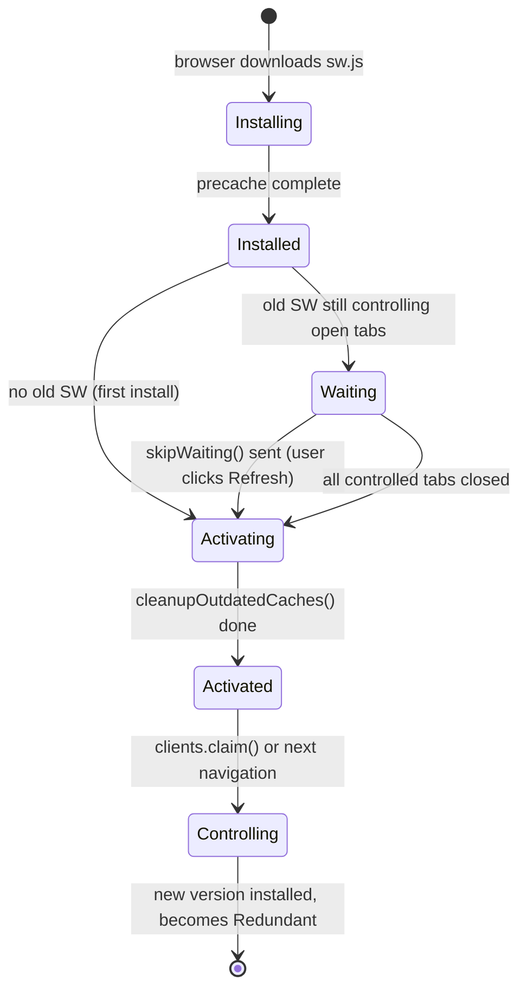
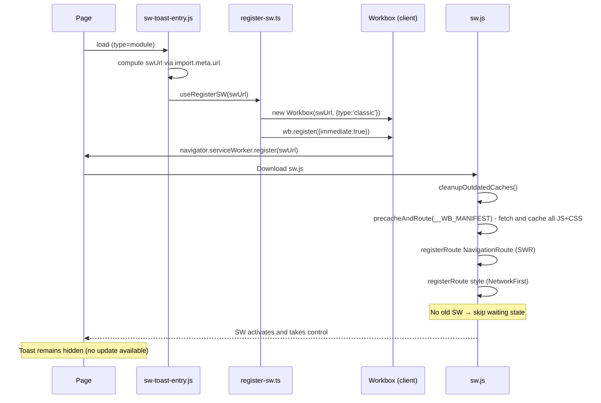
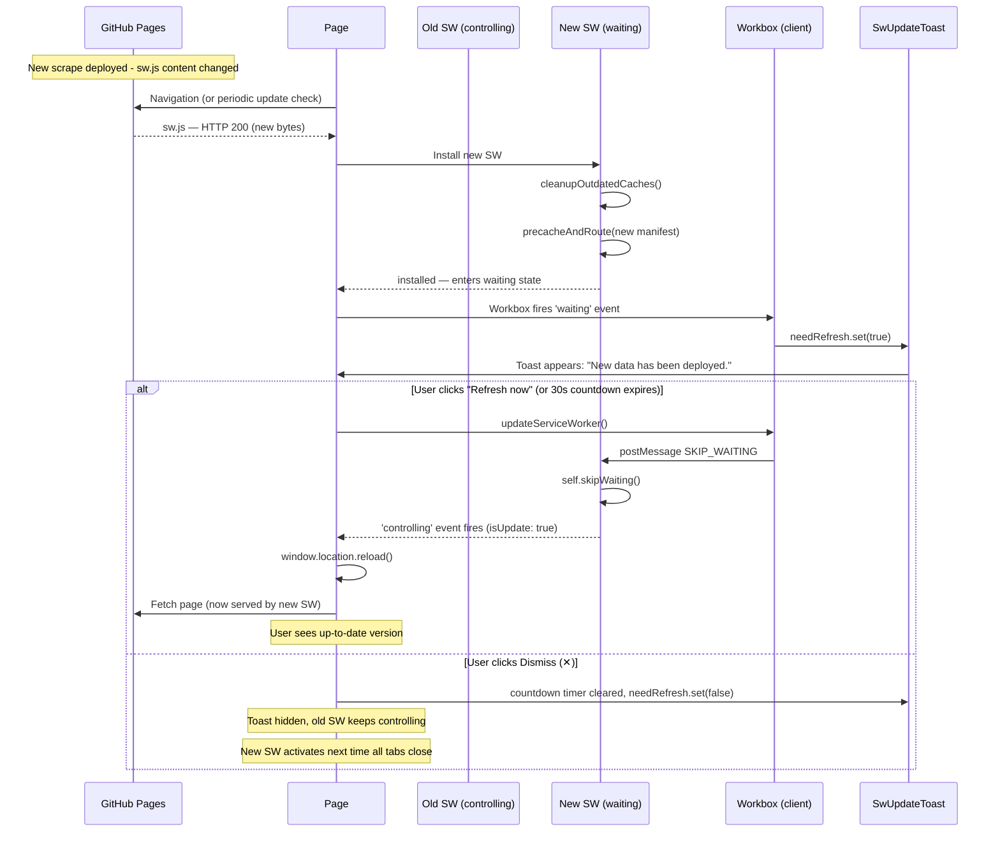

# Service Worker Architecture

This document explains how the service worker (SW) is built, registered, and updated for this site. It covers the full lifecycle, the user experience, how to verify things are working, and how to recover from failure scenarios.

---

## Table of Contents

- [What the SW Does](#what-the-sw-does)
- [Architecture Overview](#architecture-overview)
- [Caching Strategy](#caching-strategy)
- [Lifecycle Deep-Dive](#lifecycle-deep-dive)
- [The Update Flow](#the-update-flow)
- [User Experience and the SW Contract](#user-experience-and-the-sw-contract)
- [GitHub Pages Deployment Considerations](#github-pages-deployment-considerations)
- [Verifying the SW is Working](#verifying-the-sw-is-working)
- [Troubleshooting with Chrome DevTools](#troubleshooting-with-chrome-devtools)
- [Disaster Recovery](#disaster-recovery)

---

## What the SW Does

The service worker improves the experience for returning visitors by:

1. **Caching JS bundles and CSS files** at install time so subsequent page loads are near-instant, even on slow connections. All static assets are swapped atomically when a new version is deployed.
2. **Caching HTML pages** using a stale-while-revalidate strategy so pages render immediately from cache while fresh content is fetched silently in the background. Fresh HTML for the main pages is pre-fetched during SW install, so clicking Refresh in the update toast always delivers the latest market data.
3. **Notifying the user** with a non-intrusive toast when a new version has been deployed. The toast shows a 30-second countdown and then reloads automatically — users who want to defer can dismiss (✕) to cancel the timer and let the update take effect the next time all site tabs are closed.

The SW does **not** block navigation or interfere with site functionality when absent. All pages work identically without a SW (plain HTTP GET with no caching layer).

---

## Architecture Overview

### Source files

| File | Role |
|---|---|
| `client/src/sw.ts` | The service worker itself. Compiled by Workbox to `sw.js` (classic script). Defines all caching strategies. |
| `client/src/sw-toast-entry.ts` | Page-side entry point. Computes the SW URL at runtime, calls `useRegisterSW`, and mounts the update toast. |
| `client/src/shared/register-sw.ts` | Thin wrapper around `workbox-window`. Takes an explicit `swUrl` and returns a `needRefresh` Svelte store and an `updateServiceWorker` function. |
| `client/src/shared/components/SwUpdateToast.svelte` | Pure UI component. Renders the update banner when `$needRefresh` is `true`. Has no SW logic — it only reacts to the stores it receives. |
| `templates/base.html` | Injects the `<div id="sw-update-toast-root">` mount point and loads `sw-toast-entry.js` as a `<script type="module">`. |

### Build tooling

`vite-plugin-pwa` with `strategies: 'injectManifest'` is used. This means:

- Vite compiles `sw.ts` → `sw.js` (a standard classic SW script)
- Workbox injects the precache manifest (`self.__WB_MANIFEST`) into the compiled output automatically
- `injectRegister: null` — the plugin does **not** inject any registration code; registration is 100% owned by `register-sw.ts`

```
vite-plugin-pwa
  └─ injectManifest
       ├─ Compiles sw.ts → templates/scripts/dist/sw.js
       └─ Injects precache manifest (list of content-hashed JS/CSS assets)

sw-toast-entry.ts
  └─ register-sw.ts
       └─ workbox-window (Workbox)
            └─ navigator.serviceWorker.register(swUrl)
```

---

## Caching Strategy

The SW maintains **two separate caches**, each with a distinct strategy and expiry policy.

### 1. Precache — all JS bundles and CSS files

**Cache name:** `workbox-precache-v2-<origin>`  
**Strategy:** Cache-first (Workbox manages this automatically)  
**Populated:** At SW install time  
**Configured by:** `precacheAndRoute(self.__WB_MANIFEST)` in `sw.ts`; manifest built by `injectManifest` in `vite.config.ts`

**Vite-emitted JS bundles** have content hashes in their filenames (e.g. `breeder-page-BsKl3mQp.js`) — they are picked up automatically by the `globPatterns: ['**/*.{js,css}']` scanner.

**Unhashed CSS files** (`common.css`, `analysis.css`, `homepage.css`, `species-detail.css`) are referenced from Python templates with plain filenames and are NOT emitted by the Vite build. They are added to the precache manifest via `additionalManifestEntries` in `vite.config.ts` with a revision hash computed from the file content at build time. When a CSS file changes, its revision changes, and the new SW fetches the fresh copy at install time.

This means **all static assets — JS and CSS — are swapped atomically** when the new SW activates after the user clicks Refresh. There is no separate runtime CSS cache.

`cleanupOutdatedCaches()` is called **before** `precacheAndRoute` so that stale entries from prior builds are evicted when the new SW activates.

> **Why not HTML in the precache?**  
> HTML files are generated by Python (not Vite), so they cannot be included in the Vite-built precache manifest. They are handled separately by the `html-pages` runtime cache below.

### 2. HTML pages — stale-while-revalidate

**Cache name:** `html-pages`  
**Strategy:** `StaleWhileRevalidate`  
**Populated:** Pre-fetched for all main pages during SW install; then on every navigation  
**Expiry:** 200 entries max, 14 days TTL  
**Configured by:** `NavigationRoute(new StaleWhileRevalidate(...))` in `sw.ts`

Every HTML navigation request (including `/species/<slug>/` paths) is handled here. The SW returns the cached page immediately (so it renders without network latency), then fetches a fresh copy in the background and updates the cache for the next visit.

**Install-time pre-fetch (race-condition fix):** During SW install, before the SW enters the `waiting` state, an explicit `install` event handler fetches all 6 main pages (`index.html`, `breeder.html`, `dealer.html`, `snapshot.html`, `history.html`, `history-insights.html`) directly into the `html-pages` cache. Workbox waits for all `event.waitUntil` promises before transitioning to `waiting`, so the update toast can only fire after this completes. This means by the time the user sees the toast and clicks Refresh, fresh HTML is already in the cache — there is no window where clicking Refresh could serve stale market data. Individual fetch failures are swallowed so a single unreachable page never aborts the install.

The 14-day TTL is deliberate: the site updates weekly. An entry last visited 15+ days ago is stale enough that serving it from cache indefinitely would be misleading. The 200-entry ceiling prevents the cache growing unboundedly (the site has 160+ species pages plus 6 main pages).

> **Why not cache-first for HTML?**  
> HTML pages include inline `window.marketHealthRawData` which contains the live analysis results. Cache-first would mean users could see week-old analysis data indefinitely, with no way to refresh except a hard reload.


---

## Lifecycle Deep-Dive

### States

A service worker goes through four states: `parsed → installing → installed/waiting → activating → activated`. A newly installed SW enters `waiting` if an older SW is already controlling open tabs — it cannot activate until all those tabs are closed *or* it sends `skipWaiting()`.



### First visit (no existing SW)



### Returning visit with a new version available



### Registration detail

`wb.register({ immediate: true })` causes Workbox to call `navigator.serviceWorker.register()` without waiting for the page's `load` event. This is intentional: waiting for `load` would delay the update check, meaning the new-version toast would not appear until the next page load rather than on the current one.

---

## The Update Flow

How does the browser know a new version is available?

1. **On every navigation**, the browser re-fetches `sw.js` and compares it byte-for-byte to the installed version. If there is any difference — even a single character in the precache manifest hash list — the new version enters the `installing` state.

2. Workbox's `wb.register({ immediate: true })` also triggers an explicit update check as soon as the script runs, so even if the user opened the tab hours ago, the check happens quickly.

3. The precache manifest is embedded inside `sw.js` at build time. Because it contains content hashes of all bundled assets, it changes on every build that changes any JS or CSS file. In practice this means every weekly scrape + site regeneration produces a new `sw.js`.

4. The browser enforces a **one-byte difference rule** for `sw.js` itself, plus a **24-hour HTTP cache bypass**: the browser always re-requests `sw.js` to check for updates, ignoring any `Cache-Control` header on the file.

> Note: The SW caches never apply to `sw.js` itself — it is always fetched directly from the network for update checks.

---

## User Experience and the SW Contract

### What users experience

| Scenario | What happens |
|---|---|
| First visit | Pages load normally. SW installs silently in the background. No visible change. |
| Returning visit, no update | Pages load instantly from cache. No visible change. |
| Returning visit, new version deployed | Toast appears at the bottom-right: *"New spider listings available. Refreshing in 30s…"* with a **Refresh now** and a **✕** (dismiss) button. The page reloads automatically when the countdown reaches zero. |
| User clicks "Refresh now" | Page reloads instantly (countdown cancelled). They now see the latest analysis data. |
| Countdown reaches zero | Page reloads automatically. They now see the latest analysis data. |
| User clicks ✕ | Toast disappears and the countdown is cancelled. The new version will silently take over once all tabs are closed and the browser next navigates to the site. |
| User is offline | Previously visited pages load from cache. Unvisited pages fail as normal (no offline fallback page). |

### The SW contract

The toast informs users that new listings are available and reloads automatically after 30 seconds so that the common case (user is not actively mid-analysis) requires zero interaction.

- Clicking **Refresh now** skips the countdown and reloads immediately. The reload is instant (the new assets are already cached) and no data is lost.
- **The 30-second countdown** fires `updateServiceWorker()` automatically when it reaches zero, triggering `SKIP_WAITING` and reloading the page.
- Clicking **✕** cancels the countdown and hides the toast. The new version will silently take over once all tabs are closed and the browser next navigates to the site. This is an explicit opt-out — the user accepts that the current tab may show data from the previous weekly scrape until then.

The `window.location.reload()` in `register-sw.ts` only fires after the new SW has confirmed it is now controlling (the `controlling` event with `isUpdate: true`). This applies equally to the manual Refresh now path and the auto-countdown path.

### Enhanced experience for returning users

Visitors who return after the weekly scrape runs get:

1. **Fresh page load from cache** — the HTML page is returned from the `html-pages` SWR cache immediately; a background fetch updates the cache for next time. Because the install handler pre-fetched all main pages, the cached copy is already the latest version from the day the new SW was deployed.
2. **Instant asset load** — all content-hashed JS/CSS is served from the precache without any network round-trip.
3. **Managed update notification** — the toast gives context-aware control: it reloads automatically after 30 seconds (safe for passive visitors), while a dismiss option is available for users who are mid-analysis and want to finish before switching.
4. **Consistent data within a session** — because the old SW stays active until the user clicks Refresh, they are never in a state where some tabs show new data and others show old data mid-session.

---

## GitHub Pages Deployment Considerations

The site is deployed at a subpath:

```
https://christianacca.github.io/spidershop-historical-analysis/
```

This creates a subtlety for SW registration. The SW file is located at:

```
https://christianacca.github.io/spidershop-historical-analysis/sw.js
```

A hardcoded `'/sw.js'` would resolve to `https://christianacca.github.io/sw.js` — which is a 404. The Workbox client would silently fail, the `waiting` event would never fire, and the update toast would never appear in production.

### The solution: runtime URL computation

`sw-toast-entry.ts` computes the SW URL at runtime rather than baking it in at build time:

```typescript
const swUrl = new URL(/* @vite-ignore */ './sw.js', import.meta.url).href;
```

At runtime in the browser, `import.meta.url` is the absolute URL of the loaded module file:

```
https://christianacca.github.io/spidershop-historical-analysis/sw-toast-entry.js
```

`new URL('./sw.js', import.meta.url)` therefore resolves to:

```
https://christianacca.github.io/spidershop-historical-analysis/sw.js  ✓
```

This is correct for both local development (`http://localhost:8000/sw.js`) and production without any environment-specific build configuration.

### The `/* @vite-ignore */` comment

Without this comment, Vite's asset-inlining heuristic transforms `new URL('./sw.js', import.meta.url)` at **build time**, replacing `'./sw.js'` with a base64 data URI of the compiled SW source. The resulting URL would look like:

```
data:video/mp2t;base64,AAAB...
```

`navigator.serviceWorker.register()` does not accept data URIs — it throws a `SecurityError`. The `/* @vite-ignore */` comment is not optional; it is load-bearing.

### SW scope

The default SW scope is the directory containing `sw.js`. Since `sw.js` is at the root of the GitHub Pages subpath, its scope is `/spidershop-historical-analysis/`, which covers all pages on the site. No explicit scope override is needed.

---

## Verifying the SW is Working

### Quick check in DevTools

1. Open the site in Chrome
2. Open DevTools (`F12` or `Cmd+Opt+I`)
3. Navigate to **Application → Service Workers**

You should see:

```
Source:   sw.js
Status:   #<id> activated and is running
Scope:    https://christianacca.github.io/spidershop-historical-analysis/
```

If you see anything other than **"activated and is running"** in Status, check the [Troubleshooting](#troubleshooting-with-chrome-devtools) section.

### Checking the caches

In DevTools → **Application → Cache Storage**, you should see three caches after visiting a few pages:

| Cache | Contains | E2E test |
|---|---|---|
| `workbox-precache-v2-https://…` | All JS bundles + all CSS files (hashed and unhashed) | `test_precache_contains_hashed_js_bundle`, `test_css_cached_in_precache` |
| `html-pages` | HTML pages you have visited | `test_html_page_cached_in_html_pages` |

If any cache is missing, the SW is not fully initialized. Reload the page and check again.

### Checking registration in the console

Open the DevTools console and run:

```javascript
// Check the active registration
const reg = await navigator.serviceWorker.getRegistration();
console.log('Scope:', reg?.scope);
console.log('Active:', reg?.active?.state);
console.log('Waiting:', reg?.waiting?.state ?? 'none');
console.log('Installing:', reg?.installing?.state ?? 'none');

// Check what SW is currently controlling this page
console.log('Controller:', navigator.serviceWorker.controller);
```

Expected output for a healthy, up-to-date install:

```
Scope:      https://…/spidershop-historical-analysis/
Active:     activated
Waiting:    none
Installing: none
Controller: ServiceWorker { ... }
```

The scope ending in `/` and `controller` being non-null are both verified automatically by
`test_sw_registration_scope_covers_site` and `test_sw_activates_after_two_navigations`.

If `Controller` is `null`, the SW has registered but not yet claimed the page. This happens on the very first visit before the SW activates. Reload once.

### Simulating an update (developer testing)

To test the update toast without waiting for a real deployment:

1. Open DevTools → **Application → Service Workers**
2. Check **"Update on reload"** — this forces the browser to bypass the 24-hour update-check bypass and re-fetch `sw.js` on every navigation
3. In a separate terminal, make a trivial change to any JS or CSS source file and rebuild (`make generate-website`)
4. Navigate to the site — the new SW will install and the toast should appear within a few seconds

Alternatively, you can run the E2E test suite which includes dedicated SW lifecycle tests:

```bash
make test-e2e-file TEST=tests/e2e/test_pwa_sw.py
```

---

## Troubleshooting with Chrome DevTools

### Application → Service Workers panel

This is the primary debugging panel. Key controls:

| Control | What it does |
|---|---|
| **Update** | Forces an immediate re-fetch of `sw.js` and triggers the install flow if it has changed |
| **Unregister** | Removes the SW entirely. The next page load will re-register it from scratch |
| **Skip waiting** | Forces the waiting SW to activate immediately, bypassing the normal "wait for tabs to close" requirement |
| **Update on reload** | Dev-only flag that forces an update check on every navigation (ignores HTTP cache on sw.js) |

### Reading the SW status

| Status shown | Meaning |
|---|---|
| `activated and is running` | Healthy, controlling the page |
| `installing` | SW is being downloaded and the precache is being populated |
| `waiting to activate` | New SW is ready but an old SW is still controlling at least one open tab |
| `stopped` | SW is idle (not currently processing any event); this is normal between requests |
| `redundant` | SW was superseded by a newer version; no longer active |

### Network tab — checking sw.js requests

In the **Network** tab, filter by `sw.js`. On each navigation you should see:

- **HTTP 200** (first download) or **HTTP 304 Not Modified** (no changes since last check) or **HTTP 200** again if the file changed
- The request should NOT be served from ServiceWorker — `sw.js` is fetched directly from the network, not from any cache

If you see a **404**, the file is not deployed. Check the GitHub Pages deployment for that run.

If you see the request is **blocked** or returns a CORS error, check that the `sw.js` URL matches the site's origin.

### Console errors and what they mean

| Error | Cause | Fix |
|---|---|---|
| `Failed to register a ServiceWorker: The script has an unsupported MIME type ('text/html').` | `sw.js` URL returned an HTML error page (likely a 404) | Check the URL resolution; verify `sw.js` was deployed |
| `SecurityError: Failed to register a ServiceWorker: The URL ... is not allowed.` | SW URL crosses origins or uses a disallowed protocol (e.g. a data URI) | Ensure `/* @vite-ignore */` is present in `sw-toast-entry.ts` |
| `Failed to register a ServiceWorker: The path of the provided scope ... is not under the max scope allowed.` | SW scope is broader than the SW file's directory | Move `sw.js` closer to the root, or register with a narrower scope |
| `ServiceWorker: An unknown error occurred when fetching the script.` | Network error fetching `sw.js` (offline, DNS failure) | Transient; retry on next navigation |

### Inspecting the precache manifest

To see exactly what the SW has precached, run in the console:

```javascript
const cache = await caches.open('workbox-precache-v2-' + location.origin);
const keys = await cache.keys();
keys.forEach(req => console.log(req.url));
```

This lists every JS and CSS file the SW has cached. Compare it against `templates/scripts/dist/` in the deployed site to verify completeness.

### Checking the html-pages cache

```javascript
const cache = await caches.open('html-pages');
const keys = await cache.keys();
console.log('Cached HTML pages:', keys.length);
keys.forEach(req => console.log(req.url));
```

---

## Disaster Recovery

### Scenario 1 — User's SW is stuck; they never see updates

**Symptom:** The site shows old analysis data. The update toast never appeared, or appeared and was dismissed. Hard reload (`Cmd+Shift+R` / `Ctrl+Shift+F5`) fixes it temporarily but the next normal visit reverts to old data.

**Cause:** The user explicitly dismissed (✕) an earlier toast, cancelling the auto-refresh countdown, and has not closed all site tabs since. The waiting SW cannot activate until all controlled tabs are closed.

> Note: If the toast appeared and the user did not dismiss it, the 30-second countdown would have reloaded the page automatically. This scenario only arises when the user actively clicked ✕.

**User fix:**
1. Close all tabs showing the site
2. Reopen the site — the new SW will now activate on first navigation
3. Alternatively: DevTools → Application → Service Workers → **Skip waiting** to force activation immediately

**Developer action:** None required. This is expected behaviour for users who explicitly deferred the update.

---

### Scenario 2 — SW is serving a broken old version; pages crash

**Symptom:** The site throws JavaScript errors or renders incorrectly. A previous deployment cached a broken JS bundle. Hard reload does not fix it.

**Cause:** The `workbox-precache` cache contains a broken JS file from an earlier build. Because the SW serves it cache-first, the network is never consulted.

**User fix:**
1. DevTools → Application → Service Workers → **Unregister**
2. DevTools → Application → Cache Storage → delete both caches (`workbox-precache-v2-…`, `html-pages`)
3. Hard reload (`Cmd+Shift+R`)
4. The site now fetches everything fresh from the network

**Developer action:** Fix the broken build and redeploy. Once the new SW is deployed, the normal update flow will clear the bad assets on the next `cleanupOutdatedCaches()` call.

---

### Scenario 3 — sw.js returns 404 in production

**Symptom:** No SW is registered. Visiting the site in DevTools Application → Service Workers shows nothing. Console shows a SW registration failure error.

**Cause:** The `sw.js` file was not included in the GitHub Pages deployment. This can happen if:
- The `make generate-website` step was skipped or the client build was not rebuilt before deploying
- The `deploy-pages.yml` workflow did not run (e.g. it was skipped on a non-master branch)

**Verify:**

```javascript
fetch(new URL('./sw.js', import.meta.url))
  .then(r => console.log('Status:', r.status))
  .catch(e => console.error('Fetch error:', e));
```

**Fix:**
1. Check the `deploy-pages.yml` workflow run in GitHub Actions
2. Verify `website/sw.js` exists in the `gh-pages` branch
3. Re-run the workflow if needed

**User impact during outage:** The site works normally — caching simply does not apply. No toast will appear, but no errors will be thrown (the registration guard `if (el && 'serviceWorker' in navigator)` prevents any error from propagating).

---

### Scenario 4 — User clicks "Refresh now" but still sees old market data

**Symptom:** User clicks "Refresh now" in the update toast (or the 30s countdown fires) but the page still shows last week's analysis data.

**Cause:** The SWR background fetch for the current page completed before the user navigated to it that session, so the `html-pages` cache already has fresh HTML. This scenario should not occur in practice — the install handler pre-fetches all main pages before the toast fires. If it does occur, it means the pre-fetch failed silently (e.g. the site was briefly unreachable during SW install) and the user happened to click Refresh faster than the SWR background fetch could complete.

**User fix:** Do a second normal reload (`F5` / `Cmd+R`). The SWR background fetch from the first Refresh will have completed by now, so the second reload serves the fresh cached HTML. A hard reload (`Cmd+Shift+R`) always bypasses the SW and fetches fresh from the network.

---

### Scenario 5 — Multiple SW registrations from an old deployment

**Symptom:** DevTools shows two or more SW registrations for the same origin. Behaviour is unpredictable — some navigations are handled by the wrong SW.

**Cause:** This was a production bug that existed before commit `772d0c7`. `base.html` contained a manual `navigator.serviceWorker.register()` call _in addition to_ the Workbox registration. This created two competing registrations with different scopes (the manual one used `location.href` as scope, which was narrower and per-page).

**Status:** Fixed in `772d0c7`. Users visiting the site after this deployment are unaffected.

**Recovery for users who cached the old site:**
1. DevTools → Application → Service Workers
2. For each registration listed, click **Unregister**
3. Hard reload (`Cmd+Shift+R`)
4. The single correct Workbox-managed SW will re-register

You can verify there is exactly one registration in the console:

```javascript
const regs = await navigator.serviceWorker.getRegistrations();
console.log('Number of registrations:', regs.length); // should be 1
regs.forEach(r => console.log('Scope:', r.scope));
```

---

### Scenario 6 — SW breaks on iOS/Safari private browsing or Firefox in strict mode

**Symptom:** No SW, no toast, no caching. The site works normally but without caching benefits.

**Cause:** Some browsers block or restrict SW in private/incognito/strict mode. `navigator.serviceWorker` may be undefined or the registration may be denied.

**Status:** Handled by the guard in `sw-toast-entry.ts`:

```typescript
if (el && 'serviceWorker' in navigator) { … }
```

If `serviceWorker` is not in `navigator`, the entire registration path is skipped. The toast mount does not happen. The page is fully functional without the SW — no errors, no missing features.

**No action required.** Graceful degradation is the intended behaviour.
